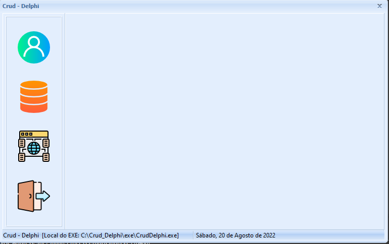
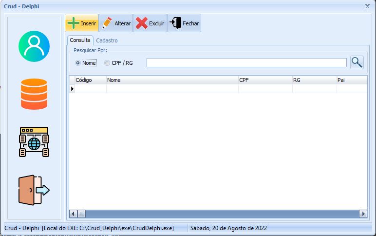

<h1 align="center">CRUD Delphi</h1> 

CRUD desenvolvido na linguagem de programação Delphi/Pascal

CRUD desenvolvido em DelPhi, com cadastro de pessoa e endereços e consumo da API [**Acessar Site**](https://viacep.com.br/) para consulta do CEP . 

### 🛠 Tecnologias

As seguintes ferramentas foram usadas na construção do projeto:

- [Object Pascal]
- [IDE - Delphi Embarcadero  10.3  Community Edition.]
- [SQLite]
- [FiredDAC]

### Telas do Sistema

### Autor

<table>
  <tr>
    <td align="center"><a href="https://www.linkedin.com/in/jose-batista-lira-junior-13839678/">
     <b>Júnior Lira</b></a> </td>
    
  </tr>
  <tr>
  
</table>